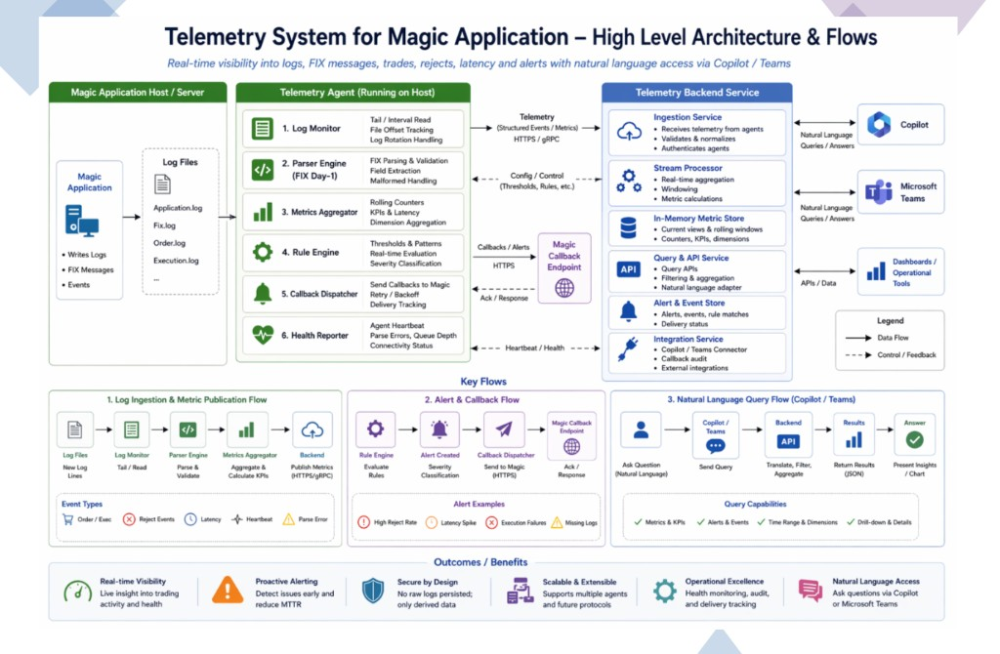

# Telemetry System for Magic — Documentation Index

This directory is the **source of truth** for the Telemetry System supporting the Magic
trading application. Specs are written first, then implemented against them (spec-driven
development). Milestone M1, the agent's log monitor, is implemented; everything downstream of it
is still specification only. See
[plan/implementation-status.md](./plan/implementation-status.md) for the current position.

If you are an AI agent working in this repository, read `docs/specs/000-overview.md` and
`docs/plan/implementation-status.md` before writing code, and follow the workflow in
`.cursor/rules/spec-driven-workflow.mdc`.

## Architecture at a glance

See [architecture.md](./architecture.md) and the diagram below.

## Specifications

| Spec | Contents |
| --- | --- |
| [000-overview.md](./specs/000-overview.md) | Purpose, problem statement, scope boundaries, glossary, requirement ID scheme |
| [001-architecture.md](./specs/001-architecture.md) | Component breakdown, deployment topology, chosen technology stack |
| [002-agent.md](./specs/002-agent.md) | Telemetry Agent internals: log monitor, pipeline, backpressure, state, restart |
| [003-fix-parsing.md](./specs/003-fix-parsing.md) | FIX tag/value parsing rules, tag allowlist, validation, parser plugin interface |
| [004-telemetry-data-model.md](./specs/004-telemetry-data-model.md) | Event envelope, metric names, dimensions, windows, cardinality limits |
| [005-alerting-and-callbacks.md](./specs/005-alerting-and-callbacks.md) | Rule types, alert lifecycle, callback protocol, retry and delivery tracking |
| [006-backend.md](./specs/006-backend.md) | Backend service, in-memory store, query engine, scaling model |
| [007-api-contracts.md](./specs/007-api-contracts.md) | Every Day-1 HTTP interface with request/response shapes and error codes |
| [008-nl-query.md](./specs/008-nl-query.md) | Copilot / Teams natural language adapter, intent catalogue, response format |
| [009-nfr-and-security.md](./specs/009-nfr-and-security.md) | Measurable performance, reliability, security and scalability targets |
| [010-configuration.md](./specs/010-configuration.md) | Full agent and backend configuration reference with defaults |
| [011-observability-and-runbooks.md](./specs/011-observability-and-runbooks.md) | Self-monitoring signals and operational runbooks |
| [012-testing-strategy.md](./specs/012-testing-strategy.md) | Test levels, FIX corpus, load and chaos testing, acceptance gates |

## Decisions

Architecture Decision Records live in [`docs/adr/`](./adr/). Each records a decision, its
rationale, and the conditions that would reverse it.

| ADR | Decision |
| --- | --- |
| [0006](./adr/0006-agent-in-python.md) | **Telemetry Agent is Python 3.14+** (current) |
| [0002](./adr/0002-backend-in-python-fastapi.md) | Backend is Python 3.14 + FastAPI |
| [0003](./adr/0003-https-json-transport-day-1.md) | Agent → backend transport is HTTPS/JSON batches on Day-1, gRPC deferred |
| [0004](./adr/0004-no-raw-log-persistence.md) | Raw log content is never persisted or transmitted |
| [0005](./adr/0005-in-memory-metric-store.md) | Backend metric store is in-memory time buckets, no database on Day-1 |

## Plan

| Document | Contents |
| --- | --- |
| [plan/implementation-status.md](./plan/implementation-status.md) | What is built, requirement coverage, deviations from these specs |
| [plan/scaffold.md](./plan/scaffold.md) | Target repository layout and milestone-by-milestone build order |
| [plan/open-questions.md](./plan/open-questions.md) | Unresolved decisions blocking or shaping implementation, with owners |

## Document conventions

- **MUST / SHOULD / MAY** carry [RFC 2119](https://www.rfc-editor.org/rfc/rfc2119) meaning.
- Every testable requirement has a stable ID (for example `FR-PRS-004`). IDs are never
  renumbered or reused; superseded requirements are marked `(withdrawn)` in place.
- Commits, pull requests, and tests reference the requirement IDs they implement or verify.
- Times and timestamps are UTC, ISO-8601, millisecond precision (`2026-06-12T04:00:00.123Z`).
- Durations in configuration use human-readable strings (`5s`, `1m`, `250ms`) parsed by the agent.
