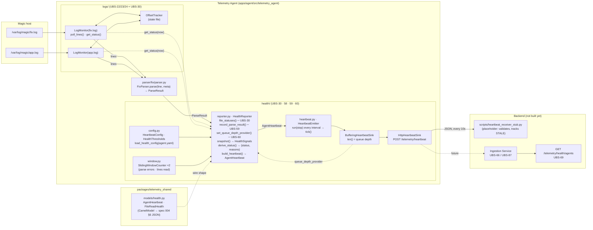
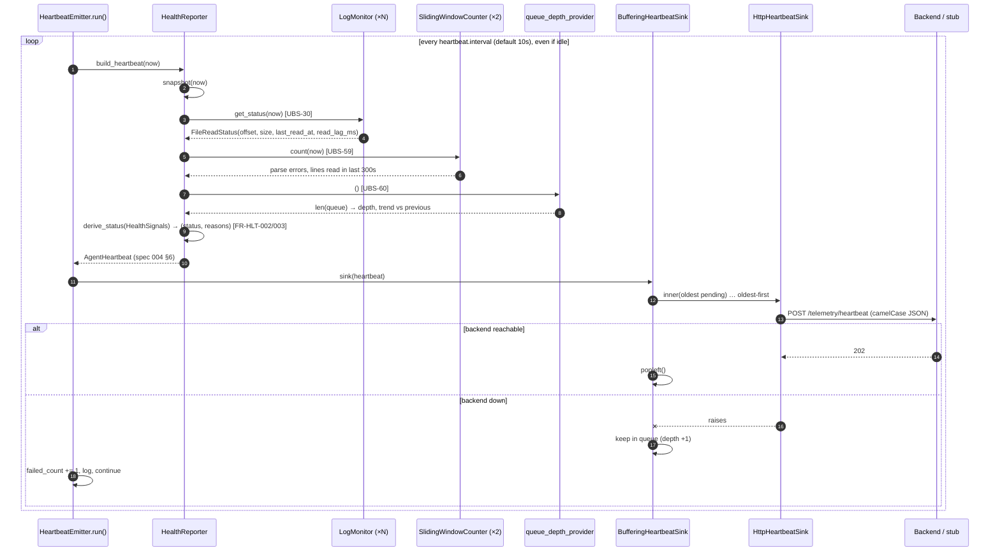

# Health Reporter — end-to-end overview (UBS-30 → UBS-58 → UBS-59 → UBS-60)

Status: Living document · Last updated: 2026-09-20 · Branches: `UBS-58-Heartbeat-Emitter` → `UBS-59-Parse-Error-Rate` → `UBS-60-Publish-Queue-Depth` (stacked, pushed, no PRs yet)

This is the reference for the agent-side Health Reporter: what each ticket added, which
functions do the work, why they are shaped that way, and how the pieces connect from a
log file on disk to a heartbeat document arriving at the backend. Decision rationale
lives in [`ubs30-notes.md`](./ubs30-notes.md) and [`ubs58-60-notes.md`](./ubs58-60-notes.md);
this document is the map.

---

## 1. What the Health Reporter is for

The Telemetry Agent sits next to Magic and tails its log files. If the agent silently
stalls, parses garbage, or cannot reach the backend, every metric downstream is wrong
while looking healthy. The Health Reporter is the agent's own self-diagnosis
(spec 002 §7, spec 011): it turns internal signals into one `status` plus a list of
`statusReasons`, packages them as a **heartbeat** (spec 004 §6), and sends it on a
fixed interval **even when there is nothing else to say** (`FR-HLT-001`).

Four tickets built it, in dependency order:

| Ticket | Adds | Requirement IDs |
| --- | --- | --- |
| UBS-30 | Per-file **read lag** — how long since a line was last read from each file | `FR-LOG-010`, `FR-HLT-001` (read-lag slice) |
| UBS-58 | The **heartbeat** itself: spec-shaped payload, status rollup with reasons, an emitter that ticks on an interval, pluggable sinks, config | `FR-HLT-001`, `FR-HLT-002`, `FR-HLT-003`, `FR-HLT-004`, spec 004 §6 |
| UBS-59 | **Parse error rate** over a rolling 5-minute window, feeding status | `FR-HLT-002` (parse slice), spec 004 §4.5 `parseErrorRate` |
| UBS-60 | **Publish queue depth** with watermarks and trend | `FR-HLT-002` (queue slice), spec 011 §1.1 |

---

## 2. End-to-end picture



Reading the diagram:

- **Left to right is the data path.** Bytes on disk → lines → parse results → health
  signals → one heartbeat document → HTTP → backend.
- **Dotted arrows are lookups, not flows.** The reporter *asks* each `LogMonitor` for its
  status at snapshot time; it *asks* the queue provider how deep the queue is. Nothing
  pushes into the reporter except parse results.
- **`AgentHeartbeat` in `telemetry_shared` is the contract.** Both agent and backend
  import the same Pydantic model (`FR-ING-022`), so a schema drift fails at validation,
  not in production.
- **The backend column is mostly future.** Today the stub receiver stands in for UBS-66/87
  (ingestion) and previews UBS-69 (health read side).

### 2.1 One heartbeat tick, as a sequence



The loop never stops on a sink failure (step 16). That is the whole point of a
heartbeat: the agent keeps trying to say "I'm alive" precisely when the backend is
having trouble hearing it.

---

## 3. UBS-30 — read lag (the foundation)

**Problem.** A file that is growing but not being read is the single most dangerous
silent failure: metrics look like "no activity" while trades are happening.

**What was built** (`logs/log_monitor.py`, `health/reporter.py`, `models/health.py`):

| Function / method | What it does | Why this way |
| --- | --- | --- |
| `Harvester.last_read_at` | Stamped every time a line is actually read. Starts as `None`. | `None` (not epoch/0) so "never read" is distinguishable from "read just now" — `FR-HLT-004`: a gap must never look like a zero. |
| `LogMonitor.get_status(now=None) -> FileReadStatus` | Snapshot of `path, offset, size, last_read_at, read_lag_ms = now − last_read_at`. | Takes `now` as a parameter so tests control time without sleeping; the same pattern is reused by every later method. Offset falls back to the `OffsetTracker` if no harvester is live. |
| `HealthReporter.file_statuses(now)` | Maps every monitored file to a `FileReadHealth` wire object, keyed by a display name (`"Fix.log"`). | The reporter never touches file contents — only what `get_status()` returns. Keyed by name so reasons read like `Fix.log: read lag 6200ms …`. |
| `HealthReporter.overall_read_lag_ms(statuses)` | `max()` of known lags; `None` if no file has been read. | Worst case is the operator-relevant number. Unread files are excluded rather than counted as 0 lag. |
| `HealthReporter.degraded_reasons()` / `is_degraded()` | Files whose lag > threshold (default 5000ms, spec 011 §1.1). | Strict `>`; an unread file is never flagged — it has no signal either way. |

**Decision recorded:** the Jira text said bytes (`log_read_lag_bytes`); specs 002/004/011
all say time. Built to time (`log_read_lag_ms`). See `ubs30-notes.md`.

---

## 4. UBS-58 — the heartbeat

**Problem.** Read lag existed, but nothing packaged it, nothing computed an overall
status, and nothing sent anything anywhere on a schedule. An idle agent and a dead
agent looked identical to the backend.

### 4.1 Wire contract — `packages/telemetry_shared/models/health.py`

| Model | Purpose | Why |
| --- | --- | --- |
| `AgentHeartbeat(CamelModel)` | Exactly spec 004 §6: `schemaVersion, agentId, instanceIds, sentAtUtc, agentVersion, uptimeSeconds, status, statusReasons[], files[], readLagMs, parseErrorCountLast5Min, callbackFailuresLast5Min, publishQueueDepth, publishBufferBytes, droppedEventsLast5Min, activeAlertCount, resourceUsage`. | `CamelModel` (existing base with `alias_generator=to_camel, extra="forbid", frozen=True`) gives camelCase on the wire and snake_case in Python for free, and rejects unknown keys so drift is caught. Every signal field is `X \| None = None`: **`null` means "no producer yet", `0` means "measured, zero"** (`FR-HLT-004`). |
| `FileReadHealth` | Per-file entry in `files[]`: `path, offset, instanceId, size, lastLineAtUtc, readLagMs, rotationsDetected, state`. | `state` is `reading` once a line has been read, else `waiting` — derived, not guessed. `rotationsDetected` stays 0 because `LogMonitor` doesn't expose it yet (documented gap). |
| `AgentStatus = Literal["healthy","degraded","unhealthy"]` | The `FR-HLT-002` vocabulary. | A `Literal` rather than an Enum keeps the JSON a plain string with no serializer. |

### 4.2 Configuration — `health/config.py`

| Function / class | Purpose | Why |
| --- | --- | --- |
| `HeartbeatConfig` (frozen dataclass) | `interval_seconds=10.0`, `agent_id`, `instance_ids`, `agent_version`. | Default **10s per spec 010 / `FR-HLT-001`**, not the ticket's 30s — spec wins, ticket to be amended. Frozen so a running agent's identity can't drift. |
| `HealthThresholds` (frozen dataclass) | Every `FR-HLT-002` threshold in one place: `read_lag_degraded_ms`, `parse_error_rate_degraded/unhealthy`, `rolling_window_seconds`, `publish_queue_high/critical_watermark`, `callback_failures_degraded`. | Declared up front on UBS-58 so UBS-59/60 **add a signal, not a config shape**. `__post_init__` refuses nonsense orderings (degraded ≥ unhealthy). |
| `load_health_config(path) -> (HeartbeatConfig, HealthThresholds)` | Reads `agent:`, `heartbeat:`, `health:` from `config/agent.yaml`. Missing file → defaults; malformed → `HealthConfigError`. | Mirrors the Rule Engine's `config_loader.py`: strict pydantic model with `extra="forbid"` for our sections (a typo like `intervl:` is refused at boot, `FR-RUL-009`'s policy), `extra="allow"` at the top level so other components' sections pass through untouched. |
| `parse_duration_seconds("10s" \| "250ms" \| "5m")` | Human durations → float seconds. | Same notation the specs and `rules.yaml` already use. |

### 4.3 Rollup and payload — `health/reporter.py`

| Method | Purpose | Why |
| --- | --- | --- |
| `HealthSignals` (frozen dataclass) | One sampled instant: `files`, `read_lag_ms`, `parse_error_count`, `lines_read`, `parse_error_rate`, `publish_queue_depth`, `publish_queue_trend`, `callback_failures`, `dropped_events`. All `None` by default. | Separates *sampling* from *judging*. `derive_status()` is a pure function of this object, so every rule is unit-testable without files, clocks, or parsers. |
| `HealthReporter.snapshot(now) -> HealthSignals` | Samples every signal the reporter has a producer for. | Single place that talks to monitors, windows and the queue provider; everything downstream is pure. |
| `HealthReporter.derive_status(signals) -> (AgentStatus, list[str])` | `FR-HLT-002` rule set + `FR-HLT-003` reasons. Collects `unhealthy` and `degraded` reason lists; unhealthy wins, and **all** reasons are returned. | One documented rule set instead of per-signal flags (the ticket's wording), because the spec says status is *computed, not hand-set*. `None` signals are skipped, never treated as 0. Returning every reason means an operator sees "parse rate 30% **and** Fix.log lagging", not just the worst. |
| `HealthReporter.build_heartbeat(now) -> AgentHeartbeat` | `snapshot()` → `derive_status()` → fill the spec 004 §6 model. `uptimeSeconds` from `started_at` via the injected clock. | The only place that knows both the internal signals and the wire model. |
| `HealthReporter.__init__(..., degraded_threshold_ms=None, *, thresholds, heartbeat, clock, queue_depth_provider)` | Backwards-compatible: UBS-30 callers still pass `degraded_threshold_ms=`; it overrides `thresholds.read_lag_degraded_ms` via `dataclasses.replace`. | Existing tests and the UBS-30 demo keep working unchanged. Injectable `clock` is what makes every window/uptime test deterministic. |

### 4.4 Emitter and sinks — `health/heartbeat.py`

| Class / method | Purpose | Why |
| --- | --- | --- |
| `HeartbeatEmitter.tick(now) -> AgentHeartbeat` | Build one heartbeat, hand it to the sink, count success/failure. **Never raises** on sink failure — logs a warning, increments `failed_count`. | `tick()` is synchronous and pure so it can be unit-tested one call at a time. Swallowing sink errors is the spec's own rule (002 §8.3: a backend outage must not affect the agent). |
| `HeartbeatEmitter.run(stop: asyncio.Event)` | `tick()` immediately, then every `interval_seconds` until `stop` is set. | First tick immediate so a restarted agent appears at once. `asyncio.wait_for(stop.wait(), timeout=interval)` gives an interruptible sleep without a busy loop. Interval is **independent of log volume** — this is the acceptance criterion that an idle log still heartbeats. |
| `HeartbeatSink = Callable[[AgentHeartbeat], None]` | The seam between the reporter and whatever transport exists. | The real transport is the Backend Publisher (M4), not built. A plain callable means the Publisher plugs in later without touching the emitter. |
| `PrintHeartbeatSink`, `LoggingHeartbeatSink` | JSON to stdout / `logging`. | Demo and local runs. |
| `HttpHeartbeatSink(url)` | `POST /telemetry/heartbeat` (spec 007 §2.3) with stdlib `urllib`; raises on non-2xx. | Zero new dependencies for a placeholder transport. Raising (instead of returning False) is what lets `tick()` count it as failed and lets `BufferingHeartbeatSink` keep the item queued. |
| `heartbeat_json(hb, wire)` | `model_dump_json(by_alias=True)`, optionally flattened to UBS-66's ingestion contract first. | One function so every sink and test serialise identically. **Since 2026-09-22 the HTTP sink defaults to `wire="ingestion"`** so the live Ingestion Service accepts it; that drops `statusReasons` and turns unmeasured signals into `0`. Decision record and reversal: [`ubs58-60-notes.md`](./ubs58-60-notes.md#wire-compatibility-with-ubs-66). |

### 4.5 Placeholder receiver — `scripts/heartbeat_receiver_stub.py`

Not part of the product. A stdlib `http.server` that (a) validates every POST body against
`AgentHeartbeat` and returns **400 with the pydantic error on any drift**, (b) keeps
`{agentId: lastHeartbeatUtc, status}` and serves it on `GET /telemetry/health/agents`,
(c) prints `STALE <agentId>` after `--stale-after` seconds of silence. It exists because
UBS-66/87/69 don't, and it is deleted when they do. Its output shape is *not* the UBS-69
contract.

---

## 5. UBS-59 — parse error rate

**Problem.** A log format change (new FIX tag layout, a Magic release) makes the parser
fail on most lines. Metrics quietly go to zero. Someone has to notice before a trading
problem is blamed for a parsing one (spec 011 runbook: "if `degraded` for parse errors,
suspect a log format change first").

### 5.1 The window — `health/window.py`

| Class / method | Purpose | Why |
| --- | --- | --- |
| `SlidingWindowCounter(window_seconds=300, bucket_seconds=1, clock)` | Rolling count of events in the last N seconds. | The heartbeat fields are literally named `…Last5Min`; this is that. |
| `record(now, n=1)` | Adds `n` to the bucket for `now`'s second. | Per-**bucket** integers, not per-event timestamps: memory is `window / bucket` (300 ints) **regardless of event rate** — the ticket's "bounded in memory (ring buffer or equivalent)". A parser storm of 100k errors/s costs the same as an idle window (tested). |
| `count(now)` | Sum of live buckets; expires anything older than the window first. | Expiry on every access is what makes the count decay as the window slides, with no background thread. |
| `_expire(now_idx)` | Drops bucket indices < `now − capacity + 1`. | Dict-keyed-by-index rather than a deque: a late event for a still-live second just lands in its bucket; one older than the window is dropped (it could never be observed again). Simpler than ring arithmetic, same bound. |

Trade-off accepted: 1s buckets mean an event can be counted for up to 1s longer than
exactly 300s. Fine for a health gauge; the Metrics Aggregator makes the same trade with
10s buckets.

### 5.2 Intake and rules — `health/reporter.py`

| Method | Purpose | Why |
| --- | --- | --- |
| `record_parse_result(result: ParseResult, now=None)` | Count one line; count a parse error if `is_parse_error(result)`. | The ticket says "subscribes to parse-error events" — there is no event bus (pipeline bridge is M1.5). An intake method the parser loop calls is the honest equivalent; the demo does exactly this with `FixParser`. |
| `record_parse_error(now)` / `record_lines_read(n, now)` | For producers that don't hand over a `ParseResult`, or count lines in bulk. | Keeps the denominator honest whichever way the pipeline ends up feeding it. |
| `is_parse_error(result) -> bool` | A parse error is: a closed-set `ParseResult.error` (`line_truncated`, frame errors, `internal_error`) **or** a framed message with `telemetry.bad_timestamp` / `unknown_msg_type`. Warnings (`body_length_mismatch`) are not errors. | **Same definition as the Metrics Aggregator's `parse_errors` counter** (`metrics/demo_sink.py`), so `parseErrorCountLast5Min` in the heartbeat and `parseErrorRate` in the metrics snapshot can never disagree about the same line. Pinned by a test against real `FixParser` output. |
| Two windows: `_parse_errors`, `_lines_read` | Rate = `errors / lines` **over the same window** (spec 004 §4.5). | A rate needs a denominator from the same period; 2 errors is 100% of 2 lines and 0.02% of 10 000. Zero lines → rate `None`, not 0 and not 100%. |
| `_parse_signal_seen` flag | All three parse fields stay `None` until a producer has called in once. | `FR-HLT-004` again: an agent nobody wired a parser into must not claim a clean parse record. |
| `_parse_error_reasons(signals, unhealthy, degraded)` | rate > 25% → `unhealthy`; > 1% → `degraded` (spec 011 §2, strict `>`). Reason: `parse error rate 2.0% (2/100 lines in last 300s) exceeds 1%`. | Reason includes numerator, denominator and window so the operator can judge confidence (2/100 vs 2000/100 000) without a second query. |

---

## 6. UBS-60 — publish queue depth

**Problem.** If the Publisher can't keep up (backend slow, network down) its queue grows
until batches are dropped. Depth is the leading indicator; drops are the lagging one.

| Method / class | Purpose | Why |
| --- | --- | --- |
| `HealthReporter(..., queue_depth_provider: Callable[[], int])` and `set_queue_depth_provider()` | The reporter *asks* for the depth at each snapshot. | The Publisher (M4) doesn't exist. A provider callable is the smallest possible seam: when the Publisher lands it registers `lambda: len(self.queue)` and nothing else changes. Until then `publishQueueDepth` is `null`. |
| `_queue_signals() -> (depth, trend)` | Reads the provider (clamped ≥ 0), compares to the previous sample: `rising` / `draining` / `flat`, `None` on the first. | The ticket asks for trend "exposed directly or derivable from consecutive snapshots". Spec 004 §6 has **no trend field**, so it is not put on the wire (which would be a schema change) — it is computed and written into the reason text, and the backend can derive the same from consecutive heartbeats. |
| `_queue_depth_reasons(signals, unhealthy, degraded)` | depth ≥ `publish_queue_high_watermark` (10) → `degraded`; ≥ `publish_queue_critical_watermark` (100) → `unhealthy`. Reason: `publish queue depth 12, rising at or above high watermark 10`. | `≥` because a watermark is a level you *reach*. 10 is spec 011 §1.1's "< 10 healthy"; **100 is a placeholder** — spec gives no second tier — flagged for team review. |
| `BufferingHeartbeatSink(inner, max_items=500)` | Queues heartbeats the inner sink rejects; on the next call drains **oldest-first**, stopping at the first failure; drops oldest when full (`dropped_count`). `len()` is the depth. | Exists so UBS-60 can be exercised end to end today: stop the stub receiver → depth rises → `degraded`/`unhealthy` → restart → drains → `healthy`. It borrows `FR-PUB-004`'s *shape* (oldest-first, drop-oldest) but none of its sizing/backoff; the Publisher replaces it. |

---

## 7. Status rollup — the one table

`derive_status()` today, with the producer for each rule:

| Condition (spec 011 §2) | Result | Signal source | Since |
| --- | --- | --- | --- |
| any file `read_lag_ms` > 5000 | `degraded` | `LogMonitor.get_status()` | UBS-30/58 |
| `parse_error_rate` > 1% | `degraded` | `SlidingWindowCounter` ×2 | UBS-59 |
| `parse_error_rate` > 25% | `unhealthy` | same | UBS-59 |
| `publish_queue_depth` ≥ 10 | `degraded` | `queue_depth_provider` | UBS-60 |
| `publish_queue_depth` ≥ 100 | `unhealthy` | same | UBS-60 |
| callback failures > 0 / stage drops / RSS / cardinality folding | — | **no producer yet** → field is `null`, rule never fires | (UBS-32–34, M1.5, M7) |

Precedence: any `unhealthy` reason → `unhealthy`; else any `degraded` reason →
`degraded`; else `healthy`. All contributing reasons are always listed.

---

## 8. What is still missing (so nobody is surprised)

| Gap | Effect today | Owner |
| --- | --- | --- |
| Backend ingestion (`POST /telemetry/heartbeat`) | Heartbeats reach only the stub receiver | UBS-66 / UBS-87 |
| Backend health read side (`lastHeartbeatUtc`, `unresponsive`, `/telemetry/health/agents`) | Stub only; UBS-58's two backend ACs live here now | UBS-69 |
| Backend Publisher | `HttpHeartbeatSink` + `BufferingHeartbeatSink` are stand-ins; `publishBufferBytes` `null` | M4 |
| Pipeline bridge (monitor → parser → reporter in a real process) | Only the demo calls `record_parse_result()` | M1.5 |
| Callback Dispatcher wired | `callbackFailuresLast5Min` `null` | UBS-32–34 |
| Resource sampling (`psutil`?) | `resourceUsage` `null` | team decision |
| `LogMonitor` rotation count / error state | `rotationsDetected` 0, `state` never `error` | UBS-22/24 owner |

---

## 9. How to verify / demo

```bash
uv run pytest tests/unit/agent/health -q            # 71 tests across the four tickets
uv run pytest tests/integration/agent/test_ubs30_health_integration.py -q

# terminal 1 — placeholder backend
uv run python scripts/heartbeat_receiver_stub.py --stale-after 6
# terminal 2 — agent demo, 2s heartbeats, POSTing to the stub
uv run telemetry-agent-heartbeat --interval 2 --sink http://127.0.0.1:8000/telemetry/heartbeat
```

Then, in order:

1. Watch terminal 1: `202 … status=healthy readLag=n/a files=1` every 2s with no log activity (**UBS-58**).
2. `echo '8=FIX.4.2|9=61|35=D|49=C|56=B|11=ORD-1|55=ABC|54=1|38=100|44=50.00|10=072|' >> demo_logs/Fix.log` → next heartbeat shows `readLag=<ms>`; wait > 5s → `status=degraded reasons=['Fix.log: read lag …']` (**UBS-30**).
3. `echo '8=FIX.4.2|9=61|35=ZZ|11=ORD-9|10=072|' >> demo_logs/Fix.log` → `parseErrorCountLast5Min` becomes 1 and a `parse error rate …` reason appears (**UBS-59**).
4. Ctrl-C terminal 1, wait ~30s, restart it → heartbeats arrive in a burst, the ones built during the outage carry `publishQueueDepth` rising past 10 with `degraded` / `unhealthy`, then the queue drains and status recovers (**UBS-60**).
5. Ctrl-C terminal 2 → terminal 1 prints `STALE magic-agent-local` after 6s (preview of **UBS-69**).

Every number you see in step 1–4 is produced by the code paths in sections 3–6; nothing
is mocked in the demo.
