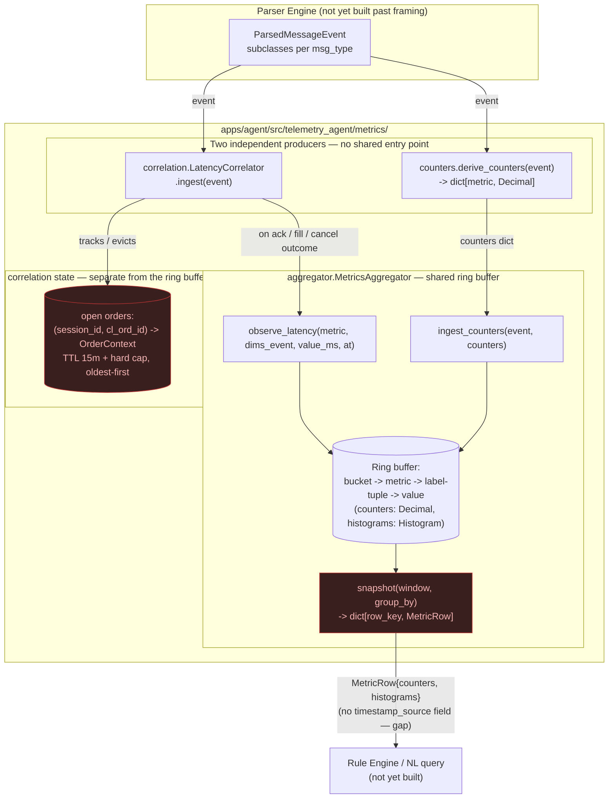
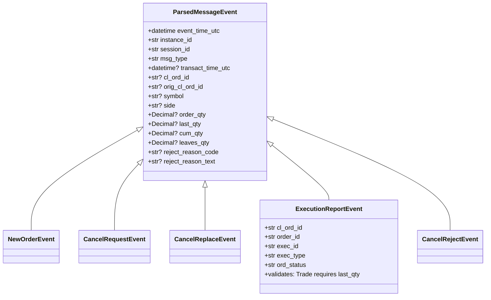
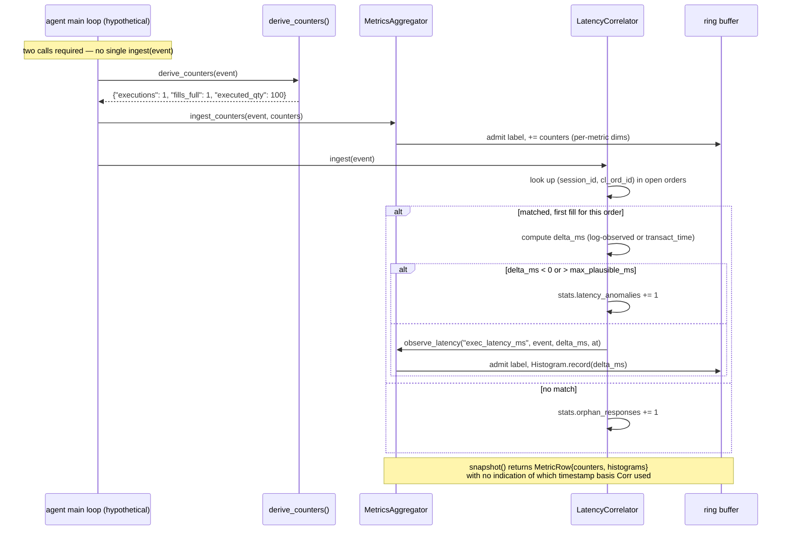

# MA-01 / MA-02 / MA-03 — Implementation Review

Status: Live review document · Last updated: 2026-09-02

This is a critical, AC-by-AC review of the Metrics Aggregator epic
(`packages/telemetry_shared/.../parsed_message.py`,
`apps/agent/src/telemetry_agent/metrics/*.py`) against the actual JIRA
ticket text, cross-checked against spec 004/003 where the ticket is silent
or looser. It records what's genuinely done, what's a deliberate deviation
worth a second opinion, and what's an outright gap — not a status report
written to look finished. Verdicts: **MET**, **PARTIAL**, **GAP**.

Test counts referenced below reflect the suite at review time: 77 tests,
all passing (`uv run pytest tests/unit -v`); `uv run mypy apps/agent/src`
clean.

---

## MA-01 — Contract + rolling-window store (recap)

Reviewed in detail in a prior session pass; summarised here so this document
stands alone.

| AC | Verdict | Note |
| --- | --- | --- |
| Schema, 17 fields, optional = `None` | PARTIAL | Schema correct, but grew by 3 fields (`transact_time_utc`, `cum_qty`, `leaves_qty`) beyond the literal AC without a checkpoint. `_dimension_value()` stringifies a `None` symbol/side/ord_type to the literal text `"None"` for any non-`reject_reason` dimension — the one concrete bug in this ticket. |
| `ingest(event)` / `snapshot(window, groupBy)` | PARTIAL | No method literally named `ingest(event)` exists — split into `ingest_counters(event, counters)` / `observe_latency(...)`. Deliberate architecture choice, not documented as an AC deviation at the time. |
| Schema agreed in writing | GAP | `docs/telemetry-schema.md` exists; sign-off from the Parser Engine owner has not happened. |
| Ring buffer, 1s/1m,5m,15m configurable | MET | One edge case unguarded: window sizes that aren't exact multiples of `bucket_seconds` truncate silently, no validation. |
| Timer-driven expiry | PARTIAL | `tick()` exists and is called from `ingest`/`snapshot`, so query results are never stale — but no actual scheduler drives it independently; the "on a timer" half of the AC is unbuilt. |
| Grouping, active set config-driven | MET (different shape) | Implemented as a *per-metric* dimension table (`FR-MET-030`), not the single flat active set the AC's wording implies. More correct against spec, but a different configuration model. |
| 5,000 cap, fold to `__other__`, `sum(groups)==total` | MET (but misleading) | Correct and tested — plus an *additional*, spec-derived `max_series_per_bucket` cap (default 2,000) not asked for by this ticket, which binds before the 5,000 figure in any realistic multi-metric deployment. The "default 5,000" in this AC is not the effective limit in practice. |
| Test: 10k/60s, 61s decay | MET | Both tests exist and pass, via `ingest_counters`, not the AC's named `ingest`. |
| Config doesn't validate dimension names | GAP (not an AC item, found during review) | A typo'd dimension name in `metric_dimensions` throws `AttributeError` at first ingest, not at config construction. |

---

## MA-02 — Order / execution / reject counters + reasons

### AC1 — Orders: new (35=D), cancel request (35=F), cancel/replace (35=G), ack (35=8 ExecType=0)

**MET.** `derive_counters()` → `orders_submitted`, `orders_cancel_requested`,
`orders_replaced`, `orders_acked`. Names match spec 004 §4.1 verbatim
(renamed from the ticket's own wording during the earlier spec-alignment
pass).

**New finding — no de-duplication by ExecID.** Spec 003's own field
allowlist documents tag 17 (ExecID)'s purpose as *"de-duplication"*
(`003-fix-parsing.md` §4). `exec_id` is on the schema, but grep confirms it
is referenced **nowhere** in `counters.py` or `correlation.py`. A
retransmitted/duplicate `ExecutionReport` (a real FIX occurrence on
reconnect/resend, not a hypothetical) is counted again — `orders_acked`,
`fills_full`, `executed_qty`, all of it, double-counted. `orders_acked`
being inflated relative to `orders_submitted` would directly corrupt any
downstream `fillRate`/reject-rate KPI (spec 004 §4.5) built on these
counters. This is a real gap grounded directly in the spec, not a nice-to-have.

### AC2 — Executions: fill / partial fill / cancelled split, `executed_qty` as Decimal/int, never float

**MET.** `fills_full`/`fills_partial` key on `leaves_qty` (spec's actual
basis) with an `ord_status` fallback; `executed_qty` and `order_qty` are
`Decimal` end-to-end, from the schema through the counters. Same ExecID
de-duplication gap as AC1 applies here too — a duplicate fill inflates
`executed_qty`.

### AC3 — Rejects: business / cancel-replace / session kept separate + `rejects_total`

**MET, well tested.** `orders_rejected`, `cancel_rejects`, `session_rejects`,
`rejects_total`; `test_business_cancel_and_session_rejects_stay_separate_but_sum_to_total`
verifies the sum invariant directly. No issues found here.

### AC4 — Reasons: 103/102/373 → canonical labels, unmapped → Other + bounded 50-list, top-N configurable, text truncated

**PARTIAL, several distinct findings:**

- **SessionRejectReason (373) path is untested and undocumented.** The
  schema deliberately reuses one `reject_reason_code` slot for three
  different source tags depending on `msg_type` (103 / 102 / 373).
  `docs/telemetry-schema.md` explicitly documents the tag-102-on-35=9 case;
  it does **not** document the tag-373-on-35=3 case with the same clarity.
  Worse: the hand-labelled fixture's session-reject event
  (`fixtures.py`, event 11) only sets `reject_reason_text`, never
  `reject_reason_code` — so the 373-sourced-code path has **zero** test
  coverage. Only the Text(58) fallback is exercised for session rejects.
- **The "config-driven map" default semantics is a judgment call, not a
  settled answer.** The current default (`DEFAULT_REASON_MAP`) is
  identity-seeded from spec 003's own canonical enum names — a deliberate
  correction made in the last review pass, on the reasoning that the parser
  already normalises raw codes to these names, so re-mapping by default
  would be a second, ungrounded renaming layer. But the ticket's own AC
  example (`"PriceExceedsLimit"`) isn't a spec 003 name at all — implying
  the ticket author expected *some* business-friendly relabelling
  out-of-the-box. This was resolved unilaterally last round; flagging it
  here as still worth a second opinion, not as settled.
- **Truncation scope verified correct, not just assumed.** Checked
  directly: raw `reject_reason_text` never becomes a dimension value itself
  (an unmapped reason resolves to the literal label `"Other"`, never the raw
  text) — only a truncated copy lands in `unmapped_seen`. This AC's data-
  minimisation intent holds.
- Top-N (`top_reject_reasons`, N configurable, default 10): MET, tested.

### AC5 — Every counter broken down by configured dimensions

**MET, with a scoped interpretation.** Read as "every counter broken down
by *its own declared* configured dimensions," not "every counter supports
all six named dimensions" — `orders_submitted` deliberately does not carry
`reject_reason` (per spec `FR-MET-030`: a counter should not "accidentally
acquire a rejectReason label"). Consistent with the spec-first reading
agreed earlier in this project; noted here because the AC's literal wording
is looser than what's built.

### AC6 — Unrecognised MsgType → `unclassified_messages`

**MET, tested directly** (`test_unrecognised_msg_type_is_counted_not_dropped`).

### AC7 — Counts verified against a hand-labelled synthetic FIX log fixture

**PARTIAL.** The fixture (`fixtures.py`) is a hand-labelled set of
**`ParsedMessageEvent` objects constructed directly in Python** — not a FIX
*log* (raw tag=value text lines) run through a parser. This tests the
counter-dispatch logic correctly, but not the AC as literally written: there
is no Parser Engine field-extraction stage yet to parse an actual log
against, so this gap is currently unavoidable rather than an oversight — but
it should be named as a gap against the AC, not silently treated as
satisfied, and revisited once the Parser Engine's extraction stage exists.

---

## MA-03 — Order correlation and latency

### AC1 — `(sessionId, clOrdId)` map, first-seen timestamp + context; OrigClOrdID links replacement to predecessor

**PARTIAL.** The map and the field both exist and are populated
(`OrderContext.orig_cl_ord_id`). But the link is **inert** — nothing reads
`orig_cl_ord_id` after it's stored; there's no lineage query, no chain
walk, and no test that asserts it's even retrievable correctly. Whether
"links a replacement to its predecessor" means *stores the link* or *does
something with it* is genuinely ambiguous from the AC text — flagging
rather than assuming.

### AC2 — TTL (15m) + hard cap eviction, oldest-first, both counted

**PARTIAL — real test gap.** TTL eviction is implemented and tested
(`test_missing_ack_evicted_by_ttl_counts_as_unmatched_not_zero_latency`).
**The hard-cap eviction path (`_evict_if_at_capacity`) has zero test
coverage** — grep against `tests/unit/agent/metrics/test_MA_03_correlation.py`
confirms no test ever fills the correlator to `max_entries`. The
"oldest-first" claim rests on a `min()` over `first_seen_at` that is exactly
the kind of logic that's easy to get subtly wrong (wrong comparison
direction, off-by-one) and is currently unverified by anything.

### AC3 — order→ack and order→first-fill latency

**MET, well tested** — including the fix (this session) that scoped these
two histograms to `NewOrderSingle` origin only, matching spec 004 §4.4's
literal "35=D →" definition rather than the original, broader design.

### AC4 — Timestamp source configurable, **recorded in the snapshot** so consumers know what it means

**GAP.** `timestamp_source` is a real, working config option and property —
but confirmed by direct grep: `MetricRow` (the actual return type of
`MetricsAggregator.snapshot()`) has no field for it at all. A caller with
only the aggregator's `snapshot()` output — which is the only interface a
Rule Engine or NL-query layer would realistically have — has no way to know
whether `ack_latency_ms` was computed from log-observed time or
`TransactTime`. The AC's own justification ("so consumers know what the
number means") is specifically about the *snapshot*, and that's exactly
where it's missing.

### AC5 — Negative or implausible → `latency_anomaly`, never recorded as 0

**PARTIAL.** Negative-latency path is tested
(`test_negative_latency_from_a_skewed_transact_time_is_an_anomaly_not_zero`).
The **"implausible" (positive but absurdly large) path has no dedicated
test** — `_max_plausible_ms`'s upper-bound branch is implemented but never
independently exercised; the one anomaly test only proves the negative
branch.

### AC6 — Unmatched orders and orphan responses counted separately, never latency 0

**MET for the orphan path** (two tests: unknown-order ack, unknown-order
cancel-reject). **Unmatched-via-cap-eviction is untested** — same root
cause as AC2's gap, since cap eviction is what's supposed to also increment
`unmatched_orders` on that path.

### AC7 — Percentiles (p50, p95, p99), fixed-bucket, constant memory

**MET, minor gaps.** `Histogram.percentile()` is implemented and two of the
three named percentiles (p50, p95) are hand-verified against worked-by-hand
expected values in `test_histogram.py` — **p99 is never directly exercised**
(low risk, same code path, but the AC names three specific values and only
two are tested). Also worth noting: there's no single convenience call that
returns the p50/p95/p99 triple the AC names — a caller gets the raw
`Histogram` and calls `.percentile()` three times themselves. Not
necessarily a gap against the AC's wording, but an ergonomic gap if a
Rule Engine consumer was expected to get this for free.

### AC8 — Tests cover: normal ack, missing ack, duplicate ack, response with no matching order

**MET, literally, plus more.** All four named scenarios exist
(`test_normal_ack_records_latency`,
`test_missing_ack_evicted_by_ttl_counts_as_unmatched_not_zero_latency`,
`test_duplicate_ack_is_not_recorded_twice`,
`test_response_with_no_matching_order_is_an_orphan`), plus three additional
tests added for `cancel_latency_ms` coverage beyond what this AC asked for.

---

## Cross-cutting gaps (not owned by either ticket individually)

1. **No single event entry point.** Feeding one event into the system
   today requires two separate calls from whatever owns the main loop:
   `aggregator.ingest_counters(event, derive_counters(event))` and
   `correlator.ingest(event)`. Combined with MA-01's missing `ingest(event)`,
   there is no unified API a real agent runtime would call once per event.
2. **No test proves MA-02 and MA-03 actually coexist on one shared
   aggregator.** The whole "one shared store, two producers" architecture
   pitch (`MetricsAggregator` backing both `ingest_counters` and
   `observe_latency`) has never been exercised with both producers writing
   into the *same instance* in one test — MA-02's tests build their own
   aggregator with `COUNTER_DIMENSIONS`, MA-03's build their own with
   `LATENCY_DIMENSIONS`, and the two configs are never merged and driven
   together. The core integration claim behind the architecture is
   unverified.
3. **ExecID de-duplication is absent system-wide** (MA-02's counters *and*
   MA-03's counters, though MA-03's *latency* is separately protected via
   `ack_recorded`/`first_fill_recorded`/`cancel_recorded` flags — only the
   counter side is exposed).

---

## Architecture — how it fits together

The sequence diagram below traces one `ExecutionReport` (a fill) through
both producers to show exactly where the two-call gap and the
timestamp-source gap sit:

---

## Suggested priority if we fix from here

1. `_dimension_value()` None-handling (MA-01) — one-line fix, prevents
   silent `"None"` labels.
2. ExecID de-duplication (MA-02) — spec-explicit, currently silently absent.
3. `timestamp_source` into `MetricRow`/snapshot output (MA-03) — the AC is
   specific that this belongs in the snapshot, not just on the correlator.
4. Hard-cap eviction test (MA-03 AC2) and implausible-latency test (MA-03
   AC5) — coverage gaps on already-implemented code, cheap to close.
5. A combined-aggregator integration test (cross-cutting) proving MA-02 and
   MA-03 actually coexist as designed.
6. Everything else in this document is either a documented, deliberate
   deviation worth your explicit sign-off (MA-01 AC2's `ingest()` shape,
   AC5's active-set model, AC6's real cap, MA-02 AC4's reason-map default)
   or blocked on work outside this epic (MA-02 AC7's "real log" fixture,
   MA-01 AC2's written sign-off).
